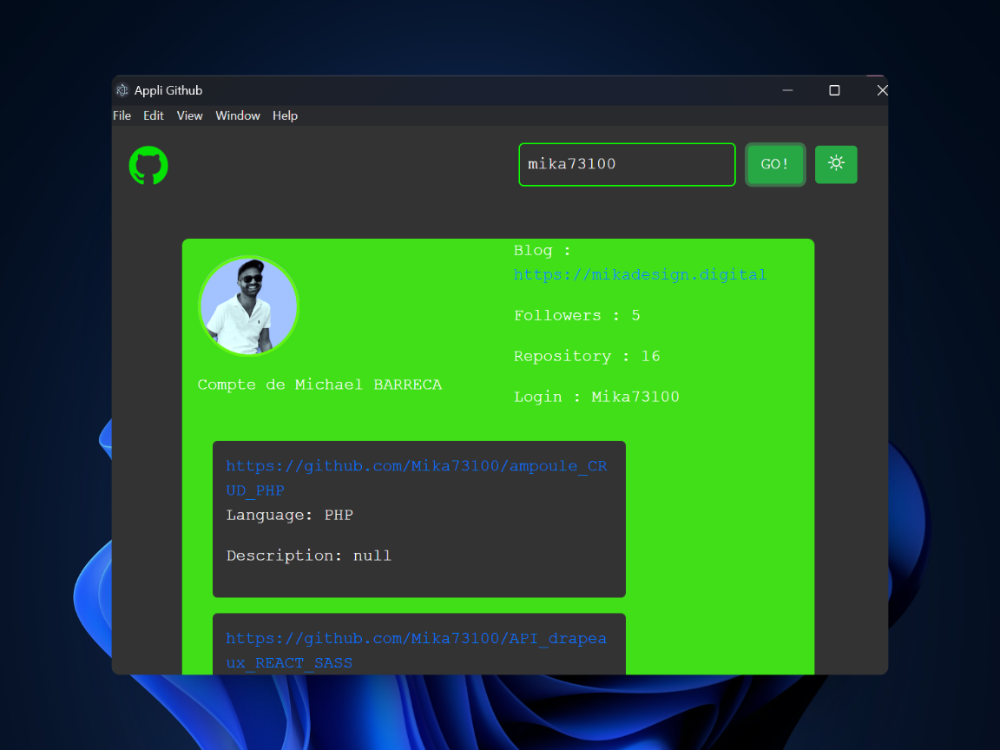

<div align="center">

# 📲 Application Desktop avec Electron JS 🔝

### 🛠️ Réalisé avec **Electron JS**, **HTML**, **CSS** & **Node.js**

---

### 💼 Mission du projet

🖊️ Cher Développeur,  

Si je t’écris cette mission, c’est qu’elle est **CAPITALE** pour l’entreprise.  

👁️ Je t’observe mettre en place des outils magnifiques fonctionnant avec les technologies Web 🚀  
😟 Cependant, tous nos postes ne sont pas toujours connectés à Internet ou à jour, à cause de contraintes techniques liées à d’autres outils installés sur ces machines.

En dépoussiérant mon bureau et mes tiroirs 🗑️, je suis tombé sur une **photo de toi plus jeune** (oui, celle de ton CV 👶).  
Et quel CV ! HTML, CSS, JS, Node, Front, Back, API… Dev Desktop 🌞 ? Là tu m’intéresses.

Il me faudrait une **application Desktop (Windows & Mac, bonus Linux Ubuntu)** sur la **thématique de ton choix** :  
👉 reprise de ton projet API réalisé en formation, ou tout autre idée originale.  

Profite-en pour **mettre ton talent en avant**, sois **force de proposition** et exploite le **plein potentiel des machines**.  
🍔 🍕 🍺 Let's go!

<br>



</div>

---

## 🚀 Fonctionnalités

- 💻 Déploiement sur Windows, macOS (et bonus Linux)  
- 🔁 **Auto-update** de l’application  
- 🔔 **Notifications Push** natives  
- 🌐 Utilisation des technologies web pour une interface moderne  
- 🛠️ Intégration backend via Node.js  
- 📡 Application utilisable **hors ligne**

---

## 📦 Installation

```bash
git clone https://github.com/TonPseudo/NOM_DU_PROJET.git
cd NOM_DU_PROJET
npm install
npm run start
```

## 🛠️ Build (pour distribuer l'app)
npm run build

⚠️ Assurez-vous d’avoir installé Node.js & Electron :
Electron - Get Started

## 🙌 Remerciements
Merci d’avoir pris le temps de découvrir ce projet ! Il s’inscrit dans un contexte réel avec des contraintes professionnelles.
N'hésitez pas à l’explorer, le forker, et pourquoi pas, y contribuer ✨

<div align="center">
⭐ Un petit like sur le repo fait toujours plaisir ! ⭐

</div>


